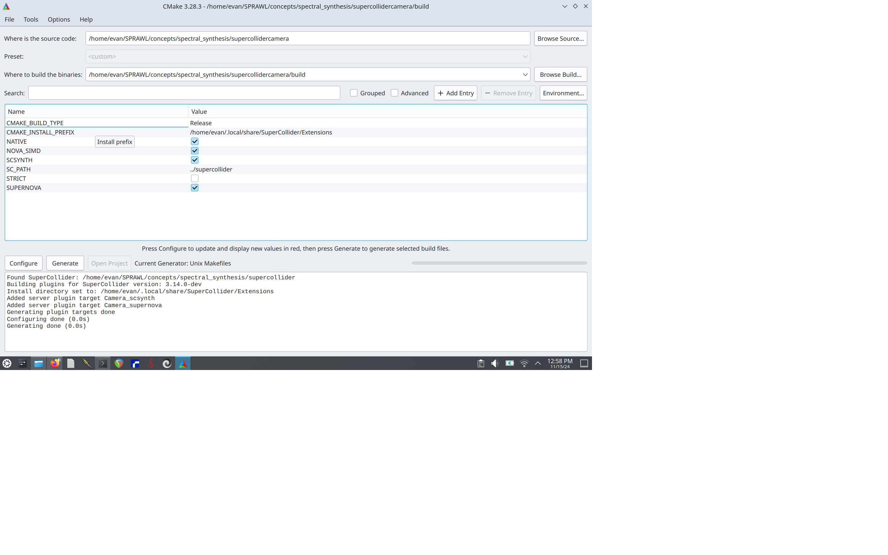

# Duncan and Evan

## Notes:
- This folder contains the script to run on a Raspberry Pi connected to speakers, `spectralfx.scd`.
- The `supercollidercamera/` folder contains a SuperCollider server plugin which can control synths with camera input
    - This particular plugin is designed to track people and map the center coordinates of the detected person to a synth. The spectralfx synth running on the Raspberry Pi described above will be the synth which this control input is mapped to.

## SuperCollider Camera
Everything in the `supercollidercamera/` folder should be installed on a personal machine. It was made clear the package dependencies of the Raspberry Pi are not to be messed with, thus requiring the plugin to run on a personal computer since it requires the `libopencv-dev` package to be installed. This package could install other dependencies on the Raspberry Pi which was not desired. The machine used for this specific performance is a MacBook Pro with a camera running its own SuperCollider server. That way, commands can be sent from the MacBook SuperCollider server to the Raspberry Pi SuperCollider server, assuming both are connected to the same Local Area Network (LAN).

To install, run the following commands:

```
sudo apt install libopencv-dev
cd supercollidercamera
mkdir build && cd build
cmake-gui ..
```

Once the window shows up, make sure the options look like the options below except with your username instead of `evan`.



Then run the following commands:

```
make -j`nproc`
make install
```
